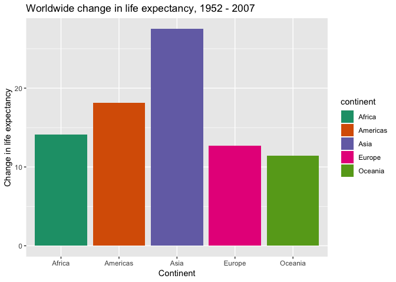

Exploring gapminder data with dplyr and ggplot2
================
Mielle Michaux

-   [Brief intro](#brief-intro)
-   [Getting started](#getting-started)
-   [1. How is life expectancy changing over time on different continents?](#how-is-life-expectancy-changing-over-time-on-different-continents)
    -   [Using the mean and median to compare life expectancy](#using-the-mean-and-median-to-compare-life-expectancy)
    -   [Plotting global trends in median life expectancy over time](#plotting-global-trends-in-median-life-expectancy-over-time)
    -   [Plotting global change in life expectancy](#plotting-global-change-in-life-expectancy)
-   [2: Look at the minimum and maximum of GDP per capita within the continents](#look-at-the-minimum-and-maximum-of-gdp-per-capita-within-the-continents)
    -   [Minimum and maximum GDP per capita with a boxplot](#minimum-and-maximum-gdp-per-capita-with-a-boxplot)
-   [3: Find countries with interesting stories](#find-countries-with-interesting-stories)
    -   [Correlation of GDP per capita and life expectancy](#correlation-of-gdp-per-capita-and-life-expectancy)
    -   [Simultaneous GDP per capita increase and life expectancy decrease](#simultaneous-gdp-per-capita-increase-and-life-expectancy-decrease)
    -   [Simultaneous population increase and life expectancy decrease](#simultaneous-population-increase-and-life-expectancy-decrease)
    -   [Simultaneous population decrease and life expectancy increase](#simultaneous-population-decrease-and-life-expectancy-increase)
-   [Special thanks to:](#special-thanks-to)

Brief intro
-----------

I'm using dplyr and ggplot2 to manipulate and visualize the gapminder dataset, which includes population, life expectancy, and GDP per capita by country from 1952 to 2007. I've done a fairly brief exploration of minimum and maximum GDP and changing life expectancy over time, and a more in-depth look at some oddball cases that go against general trends in the data.

Getting started
---------------

``` r
suppressPackageStartupMessages(library(tidyverse))
suppressPackageStartupMessages(library(gapminder))
suppressPackageStartupMessages(library(scales))
```

1. How is life expectancy changing over time on different continents?
---------------------------------------------------------------------

#### Using the mean and median to compare life expectancy

``` r
lifetime <- gapminder %>% 
  group_by(continent, year) %>% 
  summarize(mnlife = mean(lifeExp), mdlife = median(lifeExp))

lifetime
```

    ## # A tibble: 60 x 4
    ## # Groups:   continent [?]
    ##    continent  year mnlife mdlife
    ##    <fct>     <int>  <dbl>  <dbl>
    ##  1 Africa     1952   39.1   38.8
    ##  2 Africa     1957   41.3   40.6
    ##  3 Africa     1962   43.3   42.6
    ##  4 Africa     1967   45.3   44.7
    ##  5 Africa     1972   47.5   47.0
    ##  6 Africa     1977   49.6   49.3
    ##  7 Africa     1982   51.6   50.8
    ##  8 Africa     1987   53.3   51.6
    ##  9 Africa     1992   53.6   52.4
    ## 10 Africa     1997   53.6   52.8
    ## # ... with 50 more rows

Now, is it better to use the mean or median to represent this data? Let's check if the data is normally distributed.

``` r
ggplot(gapminder, aes(lifeExp)) +
  geom_histogram(binwidth = 1, fill = "dark blue") +
  xlab("Life expectancy") +
  ylab("Count") +
  ggtitle("Frequency distribution of global life expectancy")
```


It's pretty clear our data isn't normally distributed, so it's more appropriate to use the median to represent life expectancy.

#### Plotting global trends in median life expectancy over time

First, we can plot median life expectancy for 1952 and 2007, and compare those.

``` r
lifetime %>% 
  filter(year == 1952) %>% 
  ggplot(aes(continent, mdlife, fill = continent)) +
  geom_col() +  
  scale_fill_brewer(palette = "Dark2") +
  xlab("Continent") +
  ylab("Median life expectancy") +
  ggtitle("Worldwide life expectancy, 1952")
```

-1.png)

In 1952, median life expectancy for Oceania and Europe was fairly similar and at the high end, Africa and Asia similar and at the low end, and the Americas had a median somewhere in between.

``` r
lifetime %>% 
  filter(year == 2007) %>% 
  ggplot(aes(continent, mdlife, fill = continent)) +
  geom_col() +  
  scale_fill_brewer(palette = "Dark2") +
  xlab("Continent") +
  ylab("Median life expectancy") +
  ggtitle("Worldwide life expectancy, 2007")
```

-1.png)

Looks like in 2007 Oceania, Europe, Asia, and the Americas are fairly close for median life expectancy with Africa close to 20 years lower than the rest.

Now, let's look at median life expectancy for every year the data was collected.

The graph below shows median life expectancy over time for each continent. Because ggplot2 doesn't group variables the way that dplyr does, you'll notice that I wasn't always able to directly pipe my tables created with dplyr into ggplot for visualization-- sometimes, I had to go about it a different way in order to graph the same thing. I would have liked to add another line with global median life expectancy, but couldn't get it to work.

``` r
ggplot(lifetime, aes(year, mdlife, color = continent)) +
  geom_line() +
  scale_color_brewer(palette = "Dark2") +
  xlab("Year") +
  ylab("Median life expectancy") +
  ggtitle("Worldwide life expectancy, 1952 - 2007")
```


Looks like all continents generally have a trend of increasing life expectancy over time, with Europe and Oceania following a similar trend and maintaining the highest median life expectancy. Asia and the Americas have a more dramatic increase over time, starting much lower than Europe and Oceania but closing the gap to within about five years by 2007. Median life expectancy in Africa is the lowest throughout, with a less dramatic gain over time-- it appears that the gap between Africa and the rest of the continents has widened over time.

#### Plotting global change in life expectancy

Another way to look at change in life expectancy is to calculate the difference in life expectancy between 1952 and 2007 for each continent.

You'll notice in the table below that I've gone about this in a fairly messy way. Rather than subtracting the life expectancy 1952 from the life expectancy in 2007, I took advantage of the fact that it increased for every continent and simply filtered for the desired years and then subtract the maximum median life expectancy from the minimum by continent. Quick and dirty, but not ideal for replicating this if the data were different.

``` r
lifeincr <- gapminder %>% 
  group_by(continent, year) %>% 
  summarize(mdlife = median(lifeExp)) %>% 
  filter(year == 2007 | year == 1952) %>% 
  mutate(change = max(mdlife) - min(mdlife)) %>% 
  filter(year == 2007)
  
lifeincr
```

    ## # A tibble: 5 x 4
    ## # Groups:   continent [5]
    ##   continent  year mdlife change
    ##   <fct>     <int>  <dbl>  <dbl>
    ## 1 Africa     2007   52.9   14.1
    ## 2 Americas   2007   72.9   18.2
    ## 3 Asia       2007   72.4   27.5
    ## 4 Europe     2007   78.6   12.7
    ## 5 Oceania    2007   80.7   11.5

Here is the table above, represented as a bar graph. Asia had the largest increase in median life expectancy by far, with an almost 30-year gain. Oceania and Europe made the smallest gains, but as we already know that those continents have maintained the highest median life expectancy, their lack of gain isn't necessarily an indicator of anything negative. This is a great example of why it's important to examine data in more than one way-- if we only had this bar graph to analyze, our takeaway for Oceania and Europe would probably be pretty different.

``` r
ggplot(lifeincr, aes(continent, change, fill = continent)) +
  geom_col() +
  scale_fill_brewer(palette = "Dark2") +
  xlab("Continent") +
  ylab("Change in life expectancy") +
  ggtitle("Worldwide change in life expectancy, 1952 - 2007")
```



2: Look at the minimum and maximum of GDP per capita within the continents
--------------------------------------------------------------------------

make bar graph with min + max + median GDP on each continent (figure out how to get into ggplot as can't pipe it!)

#### Minimum and maximum GDP per capita with a boxplot

We can use a boxplot to examine the minimum, maximum, and median values of GP per capita for each continent.

``` r
gdp <- ggplot(gapminder, aes(continent, gdpPercap, fill = continent))

gdp +
  geom_boxplot() +
  scale_y_log10() +
  scale_fill_brewer(palette = "Dark2") +
  xlab("Continent") +
  ylab("GDP per capita")
```


``` r
minmax <- gapminder %>% 
  group_by(continent) %>% 
  summarise(min = min(gdpPercap), md = median(gdpPercap), max = max(gdpPercap)) 

minmax
```

    ## # A tibble: 5 x 4
    ##   continent    min     md     max
    ##   <fct>      <dbl>  <dbl>   <dbl>
    ## 1 Africa      241.  1192.  21951.
    ## 2 Americas   1202.  5466.  42952.
    ## 3 Asia        331   2647. 113523.
    ## 4 Europe      974. 12082.  49357.
    ## 5 Oceania   10040. 17983.  34435.

Let's see a graph of the minimum GDP per capita value for each continent.

``` r
ggplot(minmax, aes(continent, min, fill = continent)) +
  geom_col() +
  scale_fill_brewer(palette = "Dark2") +
  ggtitle("Minimum GDP per capita by continent, 1952-2007") +
  xlab("Continent") +
  ylab("GDP per capita value")
```


Now, a graph of the maximum GDP per capita value for each continent.

``` r
ggplot(minmax, aes(continent, max, fill = continent)) +
  geom_col() +  
  ggtitle("Maximum GDP per capita by continent, 1952-2007") +
  scale_fill_brewer(palette = "Dark2") +
  xlab("Continent") +
  ylab("GDP per capita value")
```


Because a common y-scale would have obscured most of the differences between continents for minimum GDP per capita, I refrained from faceting the minimum and maximum GDP graphs to display side by side. I generally avoid faceting graphs with different y scales, as the facet layout can give the impression that they are on the same scale if the audience isn't paying close attention.

3: Find countries with interesting stories
------------------------------------------

#### Correlation of GDP per capita and life expectancy

First, let's look at the relationship between GDP per capita and life expectancy, using a basic scatterplot.

``` r
ggplot(gapminder, aes(gdpPercap, lifeExp, color = continent, alpha = 0.7)) +
  geom_point() +
  scale_x_log10() +
  scale_color_brewer(palette = "Dark2") +
  xlab("GDP per capita") +
  ylab("Life expectancy") +
  ggtitle("Life expectancy vs. GDP per capita")
```


From this scatter plot, we can see that typically, GDP per capita and life expectancy appear positively correlated (as one increases, the other increases). Is there a country where this does not hold true? Can we get GDP increase with life expectancy decrease?

#### Simultaneous GDP per capita increase and life expectancy decrease

To look at GDP and life expectancy changes, we need to calculate the rate of change in life expectancy and GDP per capita between observations for each country.

``` r
change <- gapminder %>% 
  group_by(country) %>% 
  mutate(gdpchange = gdpPercap - lag(gdpPercap)) %>% 
  mutate(lifechange = lifeExp - lag(lifeExp)) %>% 
  transmute(gdpchange, lifechange, year, continent)

change
```

    ## # A tibble: 1,704 x 5
    ## # Groups:   country [142]
    ##    country     gdpchange lifechange  year continent
    ##    <fct>           <dbl>      <dbl> <int> <fct>    
    ##  1 Afghanistan      NA      NA       1952 Asia     
    ##  2 Afghanistan      41.4     1.53    1957 Asia     
    ##  3 Afghanistan      32.2     1.66    1962 Asia     
    ##  4 Afghanistan     -16.9     2.02    1967 Asia     
    ##  5 Afghanistan     -96.2     2.07    1972 Asia     
    ##  6 Afghanistan      46.1     2.35    1977 Asia     
    ##  7 Afghanistan     192.      1.42    1982 Asia     
    ##  8 Afghanistan    -126.      0.968   1987 Asia     
    ##  9 Afghanistan    -203.      0.852   1992 Asia     
    ## 10 Afghanistan     -14.0     0.0890  1997 Asia     
    ## # ... with 1,694 more rows

Next, select observations where GDP remained the same or increased, and life expectancy decreased.

``` r
diffchange <- change %>% 
  filter(gdpchange >= 0, lifechange < 0)

diffchange
```

    ## # A tibble: 54 x 5
    ## # Groups:   country [40]
    ##    country       gdpchange lifechange  year continent
    ##    <fct>             <dbl>      <dbl> <int> <fct>    
    ##  1 Benin            140.       -0.371  2002 Africa   
    ##  2 Botswana        1748.       -0.877  1992 Africa   
    ##  3 Botswana         693.      -10.2    1997 Africa   
    ##  4 Botswana        2356.       -5.92   2002 Africa   
    ##  5 Bulgaria        1015.       -0.09   1977 Europe   
    ##  6 Burundi            9.88     -3.48   1992 Africa   
    ##  7 Cambodia         103.       -9.10   1977 Asia     
    ##  8 Cameroon         240.       -2.34   2002 Africa   
    ##  9 Chad             151.       -1.05   2002 Africa   
    ## 10 Cote d'Ivoire    138.       -4.05   1997 Africa   
    ## # ... with 44 more rows

Out of the entire dataset, this has only occurred 54 times! Our assumption that GDP per capita and life expectancy will increase together was largely correct, with these 54 exceptions.

``` r
ggplot(diffchange, aes(continent, fill = continent)) +
  geom_bar() +
  scale_fill_brewer(palette = "Dark2") + 
  ggtitle("Frequency of increasing GDP per capita and decreasing life expectancy") +
  xlab("Continent") +
  ylab("Count")
```


Most of the cases of increasing GDP per capita and decreasing life expectancy occurred in Africa, with a significant subset in Europe.

``` r
ggplot(diffchange, aes(year)) +
  geom_histogram(binwidth = 5, fill = "dark blue") +
  ggtitle("Frequency of increasing GDP per capita and decreasing life expectancy") +
  xlab("Year") +
  ylab("Count")
```


Over time, GDP per capita increase and life expectancy decrease became more common, and then dropped off sharply with the 2007 dataset.

#### Simultaneous population increase and life expectancy decrease

Now, let's see if population growth and life expectancy sometimes change in opposite directions.

``` r
popup <-gapminder %>% 
  group_by(country) %>% 
  mutate(popchange = pop - lag(pop)) %>% 
  mutate(lifechange = lifeExp - lag(lifeExp)) %>% 
  filter(popchange >= 0, lifechange < 0) %>% 
  transmute(popchange, lifechange, year, continent)

popup
```

    ## # A tibble: 92 x 5
    ## # Groups:   country [49]
    ##    country  popchange lifechange  year continent
    ##    <fct>        <int>      <dbl> <int> <fct>    
    ##  1 Albania     251177     -0.419  1992 Europe   
    ##  2 Angola      857846     -0.036  1987 Africa   
    ##  3 Benin       960033     -0.371  2002 Africa   
    ##  4 Botswana    191430     -0.877  1992 Africa   
    ##  5 Botswana    193922    -10.2    1997 Africa   
    ##  6 Botswana     93811     -5.92   2002 Africa   
    ##  7 Bulgaria    220822     -0.09   1977 Europe   
    ##  8 Burundi     683213     -3.48   1992 Africa   
    ##  9 Cambodia    490539     -5.10   1972 Asia     
    ## 10 Cameroon   1686504     -0.671  1992 Africa   
    ## # ... with 82 more rows

``` r
ggplot(popup, aes(continent, fill = continent)) +
  geom_bar() +
  scale_fill_brewer(palette = "Dark2") +
  xlab("Continent") +
  ylab("Count") +
  ggtitle("Frequency of instances of increasing population and decreasing life expectancy")
```


Yes, population increases do happen concurrently with life expectancy decreases, and at almost twice the rate as the same phenomenon with GDP per capita and population. Perhaps increasing population means more pressure on resources, which decreases the health and therefor life expectancy of the population. This phenomenon is most common in countries from Africa.

#### Simultaneous population decrease and life expectancy increase

Now, let's check the opposite-- do life expectancy increases ever coincide with population decreases?

``` r
popdown <- gapminder %>% 
  group_by(country) %>% 
  mutate(popchange = pop - lag(pop)) %>% 
  mutate(lifechange = lifeExp - lag(lifeExp)) %>% 
  filter(popchange < 0, lifechange >= 0) %>% 
  transmute(popchange, lifechange, year, continent)

popdown
```

    ## # A tibble: 36 x 5
    ## # Groups:   country [22]
    ##    country                popchange lifechange  year continent
    ##    <fct>                      <int>      <dbl> <int> <fct>    
    ##  1 Afghanistan             -1998556      1.42   1982 Asia     
    ##  2 Bosnia and Herzegovina    -82964      1.04   1992 Europe   
    ##  3 Bosnia and Herzegovina   -649013      1.07   1997 Europe   
    ##  4 Bulgaria                 -404258      1.82   2002 Europe   
    ##  5 Bulgaria                 -338941      0.865  2007 Europe   
    ##  6 Croatia                   -49418      1.15   1997 Europe   
    ##  7 Czech Republic            -14995      1.61   1997 Europe   
    ##  8 Czech Republic            -44412      1.5    2002 Europe   
    ##  9 Czech Republic            -27551      0.976  2007 Europe   
    ## 10 Equatorial Guinea         -84928      1.51   1977 Africa   
    ## # ... with 26 more rows

Occasionally, yes! With only 36 observations, this is our rarest find yet.

Let's check out a scatter plot to see how our observations vary in population and life expectancy change. Here, I've labelled the observations that are visually quite different than the rest of the group.

``` r
ggplot(popdown, aes(lifechange, popchange, color = continent, label = country)) +
  scale_color_brewer(palette = "Dark2") +
  geom_point() +
  xlab("Change in life expectancy") +
  ylab("Change in population") +
  geom_text(aes(label = ifelse (lifechange > 3 | popchange < -1500000, as.character(country), '')), vjust = -1, hjust = .7) +
  geom_text(aes(label = ifelse (lifechange > 3 | popchange < -1500000, as.character(year), '')), vjust = .5, hjust = 1.2)
```


Looks like most decreases in population in this data set are under 500,000, and most changes in life expectancy are an increase of less than 2 1/2 years.

Now, let's explore if there's a spatial pattern.

``` r
popdown %>% 
  group_by(continent) %>% 
  count(continent)
```

    ## # A tibble: 4 x 2
    ## # Groups:   continent [4]
    ##   continent     n
    ##   <fct>     <int>
    ## 1 Africa        3
    ## 2 Americas      2
    ## 3 Asia          4
    ## 4 Europe       27

Let's do a quick visualization to compare.

``` r
ggplot(popdown, aes(continent, fill = continent)) +
  geom_bar() +
  scale_fill_brewer(palette = "Dark2") +
  xlab("Continent") +
  ylab("Count") +
  ggtitle("Frequency of instances of increasing life expectancy and decreasing population")
```


Yes, even without mapping there is a clear spatial pattern-- the vast majority of observations where population decreases as life expectancy increases are in Europe. Ideally, we would look at the relative frequency of each continent in the dataset to see if there is truly a disproportionate number of observations. However, we know that Europe does not have significantly more countries than all the other continents, so even without a statistical comparison it's pretty clear there is a spatial dimension.

Let's see if there's a temporal pattern as well.

``` r
popdown %>% 
  count(year) %>% 
  arrange(year)
```

    ## # A tibble: 36 x 3
    ## # Groups:   country [22]
    ##    country             year     n
    ##    <fct>              <int> <int>
    ##  1 Ireland             1957     1
    ##  2 Ireland             1962     1
    ##  3 Guinea-Bissau       1967     1
    ##  4 Portugal            1972     1
    ##  5 West Bank and Gaza  1972     1
    ##  6 Equatorial Guinea   1977     1
    ##  7 Germany             1977     1
    ##  8 Switzerland         1977     1
    ##  9 Afghanistan         1982     1
    ## 10 Lebanon             1982     1
    ## # ... with 26 more rows

``` r
ggplot(popdown, aes(year)) +
  geom_bar(fill = "dark blue") +
  xlab("Year") +
  ylab("Count") +
  ggtitle("Temporal pattern of increasing life expectancy and decreasing population ")
```


Yes, there is a clear temporal pattern to this phenomenon. It appears that over time, increasing life expectancy combined with decreasing population has become more frequent.

Special thanks to:
------------------

-   [Bar graph help](https://ggplot2.tidyverse.org/reference/geom_bar.html)

-   [Labelling points in a scatterplot](https://stackoverflow.com/questions/15624656/label-points-in-geom-point)

-   [Github-flavored markdown refresher \#1](https://guides.github.com/features/mastering-markdown/)

-   [Github-flavored markdown refresher \#2](https://rmarkdown.rstudio.com/github_document_format.html#table_of_contents)
